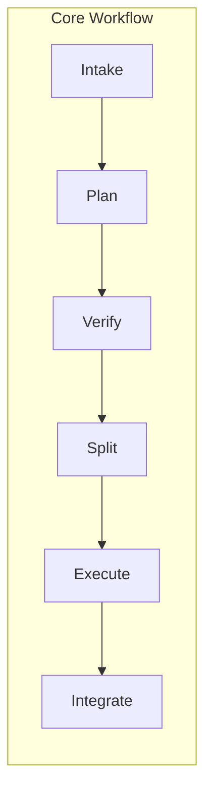
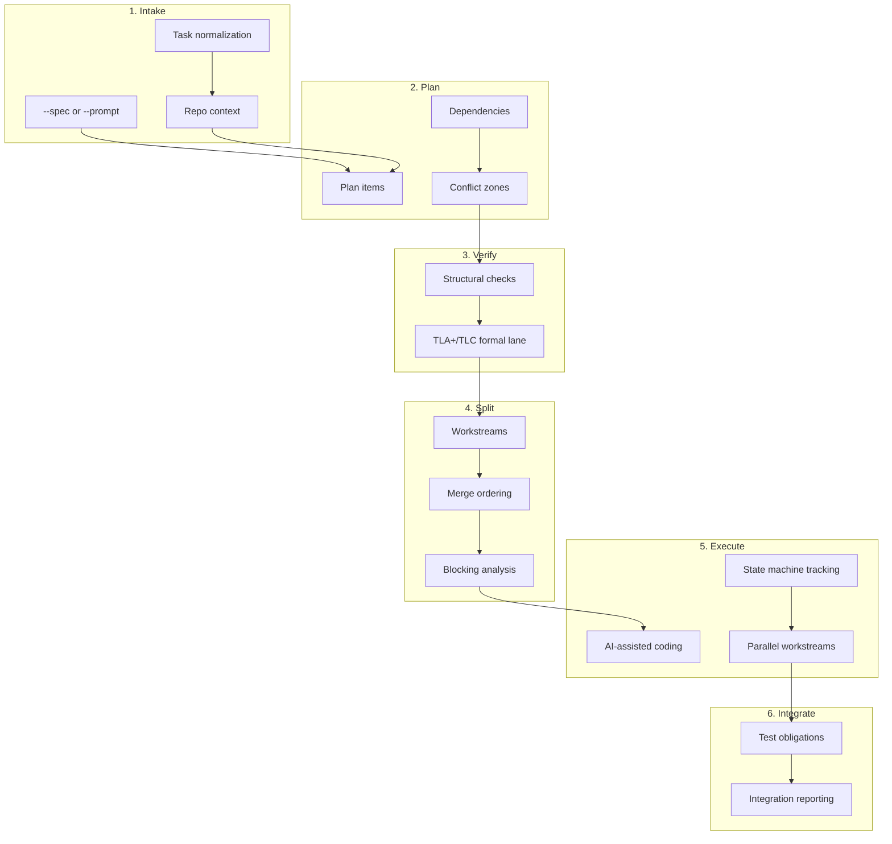

# Forge CLI

> A reliability-first CLI for agentic software development.

**Version: 1.0.0 (V1 Frozen)**  
**Package:** `@forge-cli/forge`  
**License:** MIT

Forge wraps AI coding agents in a disciplined engineering workflow — converting messy tasks into structured implementation work, preserving clean context handoffs, and enforcing validation before merge.

## Example Forge spec

Use a spec like this when you want the smoothest possible Step 1 intake. It is specific, includes acceptance criteria, and avoids vague goals that usually trigger warnings.

```md
# Improve `forge doctor` readiness summary

## Goal
Make `forge doctor` print a short, easy-to-scan readiness summary for local setup checks.

## Summary
Keep the command fast and deterministic while making pass/fail results clearer.

## Scope
- Update `forge doctor` output formatting
- Keep the existing checks and exit behavior
- Add or update tests for the CLI output

## Acceptance Criteria
- `forge doctor --help` remains available and unchanged in purpose
- `forge doctor` prints a concise readiness summary
- Passing checks are reported as clearly as failing checks
- Tests cover the main success and failure paths

## Constraints
- No changes to other Forge commands
- No network calls
- No new AI-dependent behavior
```

---

## Installation

```bash
# Global install
npm install -g @forge-cli/forge

# One-off usage (no install)
npx @forge-cli/forge <command>
```

---

## AI Model Setup

Steps 1–4 (Intake, Plan, Verify, Split) are fully deterministic and do **not** require any AI keys.

Forge uses AI only when it needs to call a model during later execution steps. To connect Forge to a model, set these environment variables:

```bash
export FORGE_MODEL_PROVIDER="openai"   # openai | anthropic | google | ollama | glm
export FORGE_MODEL_NAME="gpt-4o"       # required
export FORGE_MODEL_API_KEY="..."       # optional; usually required for hosted providers
export FORGE_MODEL_BASE_URL="..."      # optional; overrides the default provider endpoint
```

Forge's connector reads only the `FORGE_MODEL_*` variables above. It does not look for `OPENAI_API_KEY` or `ANTHROPIC_API_KEY`.

### Supported providers

- `openai` — OpenAI-compatible chat completions API
- `anthropic` — Anthropic Messages API
- `google` — Gemini / Generative Language API
- `ollama` — local Ollama server
- `glm` — Zhipu AI GLM OpenAI-compatible API

### Default base URLs

If `FORGE_MODEL_BASE_URL` is not set, Forge uses:

- `openai` → `https://api.openai.com`
- `anthropic` → `https://api.anthropic.com`
- `google` → `https://generativelanguage.googleapis.com`
- `ollama` → `http://localhost:11434`
- `glm` → `https://open.bigmodel.cn/api/paas`

### Example setups

```bash
# OpenAI
export FORGE_MODEL_PROVIDER="openai"
export FORGE_MODEL_NAME="gpt-4o"
export FORGE_MODEL_API_KEY="sk-..."

# Anthropic
export FORGE_MODEL_PROVIDER="anthropic"
export FORGE_MODEL_NAME="claude-3-5-sonnet-4"
export FORGE_MODEL_API_KEY="..."

# Google Gemini
export FORGE_MODEL_PROVIDER="google"
export FORGE_MODEL_NAME="gemini-2.5-flash"
export FORGE_MODEL_API_KEY="..."

# Ollama (local)
export FORGE_MODEL_PROVIDER="ollama"
export FORGE_MODEL_NAME="llama3"
# Usually no API key required

# GLM
export FORGE_MODEL_PROVIDER="glm"
export FORGE_MODEL_NAME="glm-4"
export FORGE_MODEL_API_KEY="..."
```

Optional: set `FORGE_EXECUTE_AUTO=1` to auto-run unblocked workstreams in `forge execute`.

---

Forge V1 is built around a **six-stage workflow** with **four lifecycle commands**.





---

## Commands

### Core Workflow Commands

| Command | Purpose |
|---------|---------|
| `forge intake` | Task specification and repo analysis |
| `forge plan` | Planning from intake artifacts |
| `forge verify` | Structural and formal verification (TLA+) |
| `forge split` | Workstream partitioning |
| `forge execute` | Parallel workstream execution with AI integration |
| `forge integrate` | Test generation and integration |

### Lifecycle Commands

| Command | Purpose |
|---------|---------|
| `forge init` | Initialize Forge in a repository |
| `forge doctor` | Pre-flight environment checks |
| `forge update` | Self-update functionality |
| `forge config` | Configuration management |

---

## Usage

```bash
# Initialize Forge in a repository
forge init

# Run the full workflow
cd /path/to/repo
forge intake --spec task.md --output-dir .forge
forge plan --repo . --output-dir .forge
forge verify --repo . --output-dir .forge
forge split --repo . --output-dir .forge
forge execute --repo . --auto --output-dir .forge
forge integrate --repo . --output-dir .forge

# Quick options
forge --version
forge --help
```

---

## Architecture

```mermaid
flowchart TD
    subgraph CLI
        CLI_ENTRY[commander.js CLI]
    end
    subgraph Stages
        INTAKE[src/intake]
        PLAN[src/plan]
        VERIFY[src/verify]
        SPLIT[src/split]
        EXECUTE[src/execute]
        INTEGRATE[src/integrate]
    end
    subgraph Artifacts[/.forge directory]
        A1[intake.json]
        R1[reports/intake-report.md]
        A2[plan.json]
        R2[reports/plan-report.md]
        A3[verify.json]
        R3[reports/verify-report.md]
        A4[split.json]
        R4[reports/split-report.md]
        A5[execute.json]
        R5[reports/execute-report.md]
        A6[integrate.json]
        R6[reports/integration-report.md]
    end
    CLI_ENTRY --> INTAKE --> A1
    INTAKE --> R1
    A1 --> PLAN --> A2
    PLAN --> R2
    A2 --> VERIFY --> A3
    VERIFY --> R3
    A3 --> SPLIT --> A4
    SPLIT --> R4
    A4 --> EXECUTE --> A5
    EXECUTE --> R5
    A5 --> INTEGRATE --> A6
    INTEGRATE --> R6
```

---

## Philosophy

Forge is built around six beliefs:

1. **Better process beats bigger prompting** — Structured intake, planning, and handoff improve outcomes more than prompt engineering alone.
2. **Fresh context is better than bloated context** — Phase-based execution with summarized handoffs keeps context windows efficient.
3. **Artifacts are better than hidden memory** — Local, inspectable files at every stage. No invisible state.
4. **Reliability matters more than speed theater** — Inspectable, resumable, debuggable workflows.
5. **Verify before implementing** — Catch risky coordination logic (retries, ownership, parallelism, ordering) before code is written.
6. **Testing is first-class** — The workflow ends with enforced validation, not just code generation.

---

## V1 Feature Summary

### Core Workflow
- **Intake** — Normalized task specification with repo context, candidate targets, risk analysis, and ambiguity detection
- **Plan** — Deterministic planning with plan items, dependency maps, conflict zones, and parallelization candidates
- **Verify** — Structural verification + optional TLA+/TLC formal lane for risky coordination logic
- **Split** — Workstream partitioning with merge ordering, ownership boundaries, and blocked-work visibility
- **Execute** — AI-assisted parallel workstream execution with state machine tracking
- **Integrate** — Test obligation enforcement, integration reporting, and acceptance criteria review

### Deployment
- **npm Packaging** — `@forge-cli/forge` with `prepublishOnly`, shebang, and executable CLI
- **Docker** — Multi-stage Dockerfile (`node:20-alpine`, non-root user) + docker-compose.yml
- **GitHub Actions** — `.github/workflows/forge.yml` with full Forge pipeline
- **Release Scripts** — `scripts/release.sh`, `scripts/publish.sh`, `CHANGELOG.md`
- **Environment Variables** — `FORGE_*` configuration override system

### Configuration
- **Config Management** — `forge config --list | --get | --set | --unset | --edit`
- **Environment Override** — `FORGE_MODEL`, `FORGE_LOG_LEVEL`, `FORGE_EXECUTE_AUTO`, etc.
- **Self-Update** — `forge update [--dry-run] [--yes]`
- **Doctor** — Pre-flight checks (Node, git, npm, network, config)

---

## Docker Usage

```bash
# Build
docker build -t forge .

# Run a command
docker run --rm -v $(pwd):/repo -e OPENAI_API_KEY forge plan --repo /repo

# Or with docker-compose
docker-compose up forge plan --repo /repo
```

---

## GitHub Actions

```yaml
- uses: actions/checkout@v4
- uses: actions/setup-node@v4
  with:
    node-version: "20"
- run: npm install -g @forge-cli/forge
- run: forge doctor --checks node,git,npm,config
- run: forge plan --repo . --output-dir .forge
- run: forge execute --repo . --auto --output-dir .forge
  env:
    OPENAI_API_KEY: ${{ secrets.OPENAI_API_KEY }}
```

Full documentation: [`docs/github-action.md`](docs/github-action.md)

---

## Configuration

Forge reads configuration from three sources in order of precedence:

1. Command-line flags (`--repo`, `--model`, etc.)
2. Environment variables (`FORGE_*`)
3. `~/.forge/config.yaml` (managed by `forge config`)

```bash
forge config --list
forge config --get model
forge config --set model=anthropic/claude-3-5-sonnet
forge config --unset model
```

---

## Development

```bash
# Install dependencies
npm install

# Build
npm run build

# Typecheck
npm run typecheck

# Run all tests
npm test

# Smoke test
npm run smoke

# Release (bumps version + tag)
npm run release patch  # or minor / major

# Publish dry-run
npm run publish:dry
```

---

## Release

| Status | Task |
|--------|------|
| Complete | All V1 features implemented and frozen |
| Ready | `npm publish --access public` infrastructure configured |
| Pending | Manual npm organization setup |

Step 2: Plan is implemented through Batch 3 Part 5.
Step 2 is frozen for V1 except for future bug fixes.
Step 3: Verify is implemented through Batch 3 Part 4.
Step 4 Batch 3 Part 4 is complete.
Step 4 Batch 3 Part 5 closes the Step 5 handoff contract, including the Forge Execute Gate.
Step 4 is in bug-fix-only maintenance mode for V1.

---

## What Forge Is

- An open-source CLI
- A structured execution workflow for AI coding
- A reliability-first orchestration layer
- A learning vehicle for agent harness design

## What Forge Is Not

- A replacement for coding agents (complements them)
- A magic autonomous coding company
- A promise of bug-free code
- A SaaS dashboard or hosted service

---

## Target User

Developers, software engineers, and technically curious builders who:
- Already see value in AI coding
- Want more structure, confidence, and discipline
- Prefer inspectable artifacts over hidden state
- Care about validation before merge

---

## License

MIT
