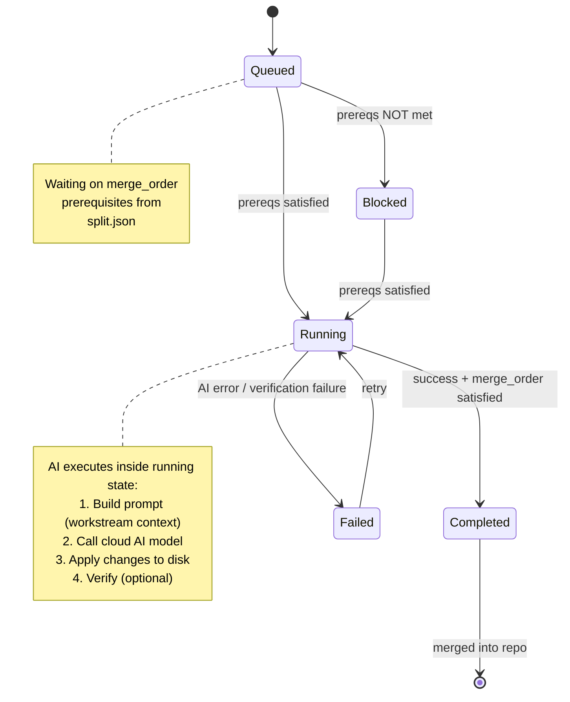
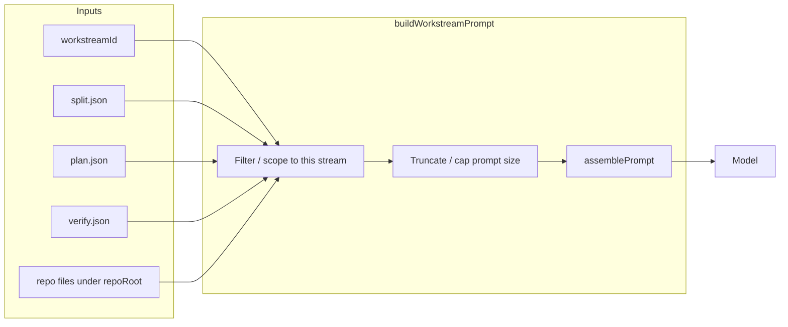
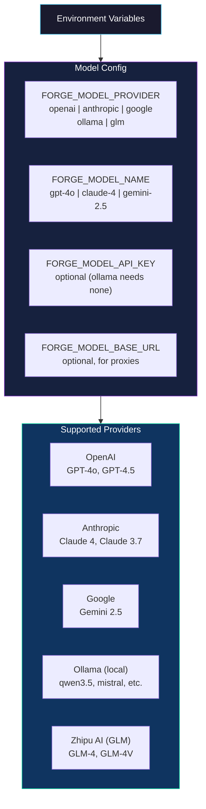
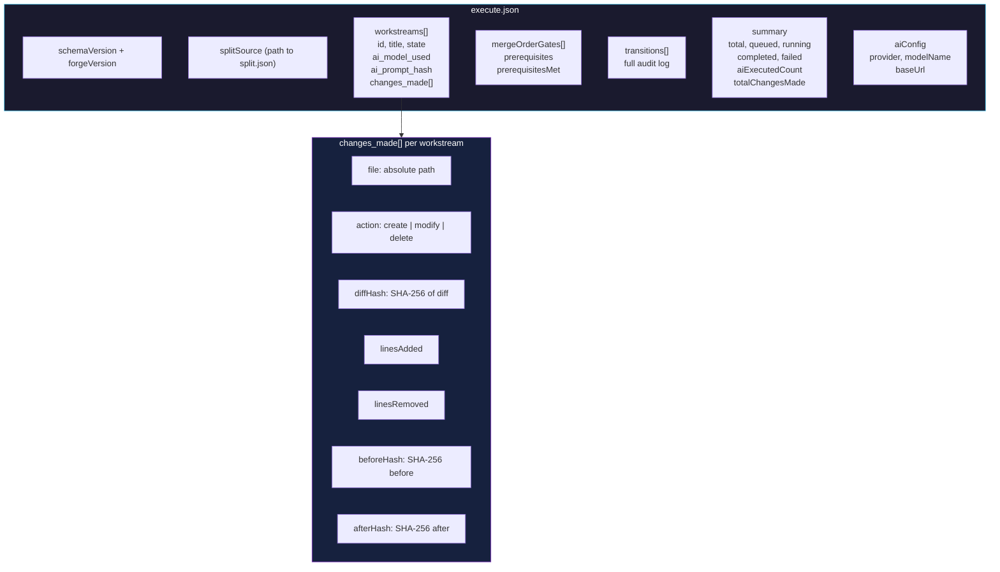
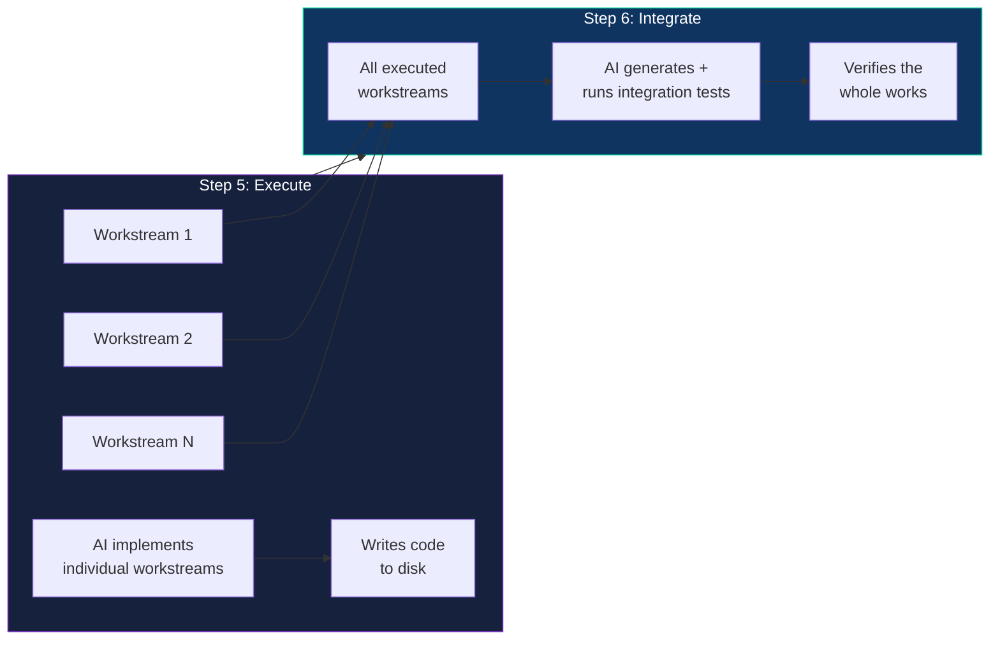

# Forge Step 5 — AI-Powered Execute Flow

> This document describes the V1 AI-powered execution flow for Forge Step 5 (`forge execute`).
> Generated from the Step 5 Batch 3 specification.

---

## Overview

Step 5 is the execution engine of the Forge pipeline. After `forge split` partitions the work into workstreams, Step 5 executes each one using an AI model. The state machine enforces merge order — ensuring workstreams run in the correct sequence — while an AI model does the actual code implementation.

---

## High-Level Flow

```mermaid
flowchart TB
    subgraph INIT["1. INITIALIZE"]
        A1([forge execute CLI])
        A2{Read split.json}
        A3{Validate Artifact}
        A4[Create Execute State<br/>queued + merge_order map]
        A1 --> A2 --> A3 --> A4
    end

    subgraph SELECT["2. SELECT WORKSTREAM"]
        B1{Find Unblocked<br/>Workstreams}
        B2{Any<br/>Unblocked?}
        B3[Select Next<br/>workstream]
        B4(["All Terminal<br/>State Reached"])
        B1 --> B2
        B2 -->|YES| B3
        B3 -->|state → running| B1
        B2 -->|NO| B4
    end

    subgraph AI_EXEC["3. AI EXECUTION PHASE"]
        direction LR
        C1[/"3a. BUILD PROMPT<br/>one prompt per workstreamId<br/>scoped plan/verify + path snippets<br/>merge order + caps (FORGE_EXECUTE_*)/"]
        C2[/"3b. CALL AI MODEL<br/>user-provided cloud model<br/>gpt-5.4 / claude-Opus-4.7 / GLM-5.1<br/>returns code changes"/]
        C3[/"3c. APPLY CHANGES<br/>write files to disk<br/>track: path, hash, lines"/]
        C4[/"3d. VERIFY<br/>typecheck / lint<br/>optional per-workstream"/]
        C1 --> C2 --> C3 --> C4
    end

    subgraph TRANSITION["4. STATE TRANSITION"]
        D1{Merge Order<br/>Prereqs Met?}
        D2[COMPLETED<br/>+ merged]
        D3[QUEUED<br/>re-queue]
        D4[FAILED<br/>AI error or<br/>verify failure]
        D1 -->|YES + success| D2
        D1 -->|NO| D3
        C4 -->|error| D4
    end

    subgraph WRITE["5. WRITE ARTIFACT"]
        E1[execute.json<br/>workstreams + transitions<br/>changes_made + ai_model_used<br/>ai_prompt_hash]
        E2[execute-report.md<br/>human-readable summary]
    end

    INIT --> SELECT
    SELECT --> AI_EXEC
    AI_EXEC --> TRANSITION
    TRANSITION -->|loop back| SELECT
    TRANSITION -->|all terminal| WRITE

    style INIT fill:#1a1a2e,stroke:#4cc9f0,color:#ffffff
    style SELECT fill:#1a1a2e,stroke:#4cc9f0,color:#ffffff
    style AI_EXEC fill:#16213e,stroke:#7b2cbf,color:#ffffff
    style TRANSITION fill:#1a1a2e,stroke:#e63946,color:#ffffff
    style WRITE fill:#0f3460,stroke:#06d6a0,color:#ffffff
```

---

## State Machine

The state machine drives all workstream transitions. It is **unchanged from Batch 1/2** — the AI execution happens inside the `running` state.



### State Definitions

| State | Meaning |
|-------|---------|
| `queued` | Waiting for merge_order prerequisites to complete |
| `running` | AI is actively implementing this workstream |
| `completed` | AI succeeded, merge_order satisfied, merged into repo |
| `failed` | AI execution failed or verification failed |
| `blocked` | Permanently blocked by upstream (merge_order cannot be satisfied) |

---

## AI Execution Details

### How the prompt is chosen

There is **no separate prompt catalog.** Each AI run builds **exactly one prompt for one workstream**.

1. **Selection** — Interactive `forge execute`, auto mode (`FORGE_EXECUTE_AUTO=1`), or other CLI paths pick a **`workstreamId`** when a stream enters the `running` state.
2. **Build** — `executeWorkstreamWithAI` in `src/execute/cli.ts` loads `.forge/split.json`, `.forge/plan.json`, and `.forge/verify.json`, then calls **`buildWorkstreamPrompt`** (`src/execute/prompt-builder.ts`) with `{ workstreamId, splitArtifact, planArtifact, verifyArtifact, repoRoot }`.
3. **Resolution** — The builder finds the **single workstream** in `split.json` whose `id` matches `workstreamId`. All sections of the prompt are **derived from that object’s fields** (and from artifacts filtered through those fields).

The same assembly code runs for every stream; **only the inputs change** based on which `workstreamId` is active.



### Why the prompt matches that stream (scoping)

The model does not receive the full plan or verify dump. Content is **scoped** so it applies to **this** workstream only:

| Source | What is included for this stream |
|--------|-----------------------------------|
| **`split.json`** (this workstream) | **Title** and **description** (length-limited), **`sourcePlanItemIds`**, **`likelyAffectedPaths`**, **`mergeOrderRequirements`**. |
| **`plan.json`** | Plan items whose `id` is in **`sourcePlanItemIds`**; **conflict zones** that touch **`likelyAffectedPaths`**; **carried-forward concerns** whose `planItemIds` overlap those plan items. |
| **`verify.json`** | **Findings** and **constraints** linked (via verification cases) to the same **plan item** set. |
| **Disk** | Snippets for files listed in **`likelyAffectedPaths`** only (paths resolved under **`repoRoot`**). |

Together with explicit rules (“only modify files listed in Target Files”), this keeps the task **localized**: merge prerequisites, verify/plan signals for the same files and plan items, and editable paths all line up with the chosen stream.

**Note:** `buildWorkstreamPrompt` returns **`warnings`** (e.g. missing files, truncated snippets). The execute CLI currently passes **`prompt`** into the model; surfacing `warnings` on the console or in the artifact is optional future polish.

### What feeds the AI prompt (summary diagram)

```mermaid
flowchart LR
    subgraph INPUTS["Scoped inputs"]
        W["Workstream<br/>title + description"]
        F["Target paths<br/>likelyAffectedPaths → snippets"]
        P["Plan items + zones + concerns<br/>filtered by ids/paths"]
        V["Verify findings + constraints<br/>filtered by plan items"]
        M["Merge order<br/>mergeOrderRequirements"]
    end

    subgraph PROMPT["Constructed prompt"]
        direction TB
        P1["System role"]
        P2["Workstream + plan item context"]
        P3["Merge order prerequisites"]
        P4["Critical constraints"]
        P5["Carried-forward concerns"]
        P6["Target file snippets + repo root"]
        P7["Task + JSON output format + rules"]
    end

    subgraph OUTPUT["AI output"]
        O1["## CHANGES JSON array"]
        O2["file, action, content"]
        O3["Applied to disk"]
    end

    INPUTS --> PROMPT
    PROMPT --> OUTPUT

    style INPUTS fill:#1a1a2e,stroke:#4cc9f0,color:#ffffff
    style PROMPT fill:#16213e,stroke:#7b2cbf,color:#ffffff
    style OUTPUT fill:#0f3460,stroke:#06d6a0,color:#ffffff
```



### Per-workstream prompt layout (actual template)

The following mirrors **`assemblePrompt`** in `src/execute/prompt-builder.ts`. Copy is intentionally **short**; full source lives on disk. Snippet sizes default to a **total** budget across files plus a per-file ceiling (see [Prompt size limits](#prompt-size-limits)).

```
# Role
Senior engineer. Implement changes in the repo below; snippets are hints only.

# Workstream
Title: {title}
Task: {description_truncated}

Plan items:
  - {plan_item_title}: {category}/{riskLevel}
  ...

# Merge order (complete first)
(prerequisite bullets or “None — …”)

# Constraints (verify + plan)
(CONFLICT ZONE / FINDING / CONSTRAINT lines, line-capped)

# Concerns (plan carry-forward)
(filtered concern bullets)

# Target files (truncated snippets — read full files on disk)
FILE: {path}
---
{snippet}
---

# Repo
{repoRoot}

# Output
(## CHANGES plus a fenced JSON code block — must match execute model connector parser)

# Rules
1. Only paths listed under Target files
2. …
```

The shipped prompt embeds a minimal **## CHANGES** / **```json** example on one line so the model follows the same shape `parseModelResponse` expects in `src/execute/model-connector.ts`.

### Prompt size limits

Long prompts are clamped so execute stays usable across models. Defaults can be overridden with environment variables (parsed as integers, clamped to safe min/max in code):

| Variable | Default | Role |
|----------|---------|------|
| `FORGE_EXECUTE_FILE_SNIPPETS_TOTAL_CHARS` | `5000` | **Total** character budget split across all target files that have content (each file also obeys the per-file ceiling). Stops many paths from producing 30k+ prompts. |
| `FORGE_EXECUTE_FILE_SNIPPET_CHARS` | `1200` | Per-file **ceiling** for an embedded snippet (head + tail + middle omission). |
| `FORGE_EXECUTE_TEXT_FIELD_MAX_CHARS` | `400` | Max characters for the workstream description (single line, whitespace collapsed); merge-order and other bullets also respect related caps. |
| `FORGE_EXECUTE_CONSTRAINT_LINES_MAX` | `14` | Max lines in the conflict-zone / finding / constraint block before a “see plan.json / verify.json” footer. |
| `FORGE_EXECUTE_MAX_CONCERNS` | `6` | Max carried-forward concern bullets. |
| `FORGE_EXECUTE_PROMPT_MAX_CHARS` | *(unset)* | Optional hard cap on the **entire** assembled prompt. When set (≥ `12000`), text before `# Output` may be truncated so the `## CHANGES` / JSON instructions stay intact. Use only if env snippet caps are not enough. |

See `src/execute/prompt-builder.ts` for exact clamp ranges and helpers (`truncateFileBodyForPrompt`, `truncateOneLine`).

---

## Merge Order Enforcement

Merge order is the backbone of safe sequential execution. A workstream cannot transition to `completed` until ALL of its prerequisites are in the `merged set` (i.e., they have already transitioned to `completed`).

```mermaid
flowchart LR
    A["Workstream A"] -->|"must complete first"| B["Workstream B"]
    B -->|"must complete first"| C["Workstream C"]

    style A fill:#0f3460,stroke:#06d6a0,color:#ffffff
    style B fill:#0f3460,stroke:#06d6a0,color:#ffffff
    style C fill:#0f3460,stroke:#06d6a0,color:#ffffff

    note right of A
        state: completed
        in merged set: YES
    end note

    note right of B
        state: completed
        in merged set: YES
    end note

    note right of C
        state: running
        waits for B in merged set
    end note
```

### Merge Order Rules

1. A workstream in `queued` can only transition to `running` when ALL its `mergeOrderRequirements` are in the `merged set`
2. A workstream in `running` can only transition to `completed` when ALL its `mergeOrderRequirements` are in the `merged set`
3. The `merged set` only grows — a workstream once `completed` never leaves it
4. `failed` workstreams are NOT in the merged set and block their dependents

---

## Model Provider Configuration

Users provide their own AI model. Forge reads configuration from environment variables:



---

## execute.json Artifact

The final artifact records everything: workstream states, AI model calls, and file changes.



---

## CLI Interaction

### Interactive Mode (default)

```
$ forge execute

=== Workstream Status ===
[1] ws-add-auth         queued    waiting on: []
[2] ws-api-middleware   queued    waiting on: [ws-add-auth]
[3] ws-integration      queued    waiting on: [ws-api-middleware]

Commands: run <id> | done <id> | fail <id> [reason] | status | exit

> run 1
[AI] Calling gpt-4o for: ws-add-auth...
[AI] Modifying: src/auth.ts (+42 lines)
[AI] Creating: src/auth.test.ts (+38 lines)
✓ ws-add-auth COMPLETED — 2 files, +80 lines

> run 2
[AI] Calling gpt-4o for: ws-api-middleware...
[AI] Modifying: src/api/middleware.ts (+67 lines)
✓ ws-api-middleware COMPLETED — 1 file, +67 lines

> run 3
[AI] Calling gpt-4o for: ws-integration...
✓ ws-integration COMPLETED — 3 files, +120 lines
```

### Auto Mode

```
$ FORGE_EXECUTE_AUTO=1 forge execute
[AI] Auto-executing 3 unblocked workstreams...

[AI] ws-add-auth (1/3)...
✓ ws-add-auth COMPLETED — 2 files, +80 lines

[AI] ws-api-middleware (2/3)...
✓ ws-api-middleware COMPLETED — 1 file, +67 lines

[AI] ws-integration (3/3)...
✓ ws-integration COMPLETED — 3 files, +120 lines

All workstreams complete. Artifact written to .forge/execute.json
```

### Environment Variables

| Variable | Required | Description |
|----------|----------|-------------|
| `FORGE_MODEL_PROVIDER` | **Yes** | `openai`, `anthropic`, `google`, `ollama`, `glm` |
| `FORGE_MODEL_NAME` | **Yes** | Model name (e.g., `gpt-4o`, `claude-3-5-sonnet-4`) |
| `FORGE_MODEL_API_KEY` | No | API key (not needed for Ollama) |
| `FORGE_MODEL_BASE_URL` | No | Proxy or self-hosted endpoint |
| `FORGE_EXECUTE_AUTO` | No | Set to `1` to auto-execute all unblocked workstreams |

Optional **`FORGE_EXECUTE_*`** variables (file snippet size, description length, constraint line caps, max concerns) tune the **workstream prompt** built for the model. See **Prompt size limits** under [AI Execution Details](#ai-execution-details).

---

## Step 5 vs Step 6 Responsibility



| Step | What it does |
|------|-------------|
| **Step 5** | AI implements each workstream — makes actual code changes per workstream |
| **Step 6** | AI runs integration tests against the whole — verifies everything works together |

---

## V1 Scope vs V2 Future

### V1 (This Implementation)
- Single AI model execution, one workstream at a time
- Merge order strictly enforced (serial execution)
- User provides any OpenAI-compatible model
- No streaming output, no agentic loops, no tool use
- State machine drives all transitions

### V2 (Future Ideas)
- Multi-agent orchestration: parallel AI workstream execution
- Agent adapter plugin system (users provide their own agent adapters)
- Streaming output display during AI execution
- Multi-turn AI dialogue with tool use
- Model management (switch models mid-pipeline)

> See `future_idea_implementation/multi-agent-orchestration.md` for the V2 vision.
