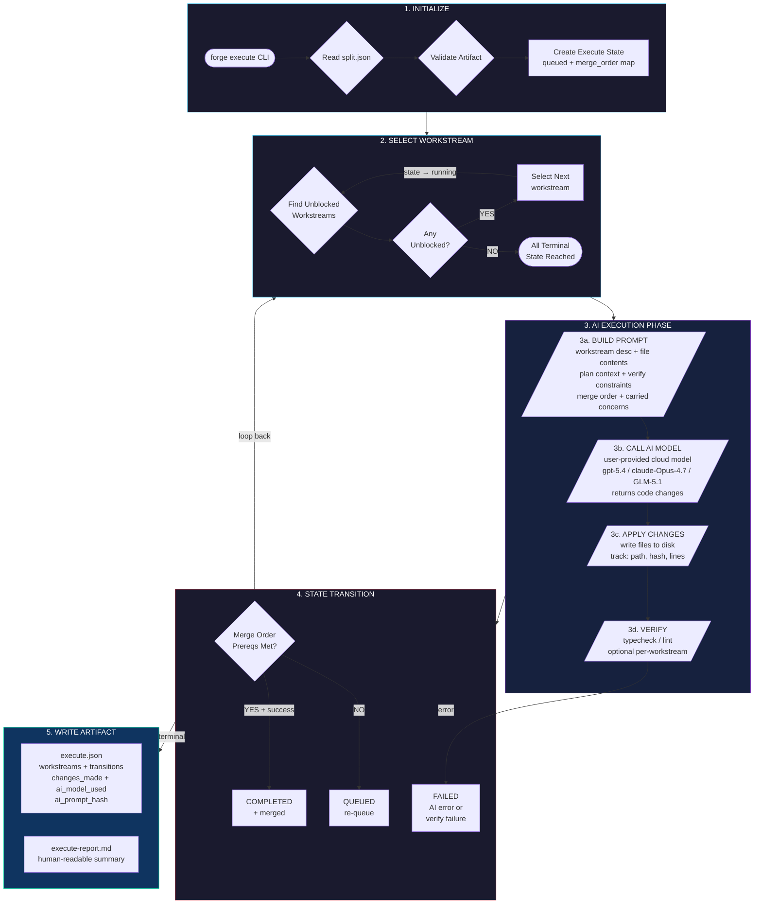
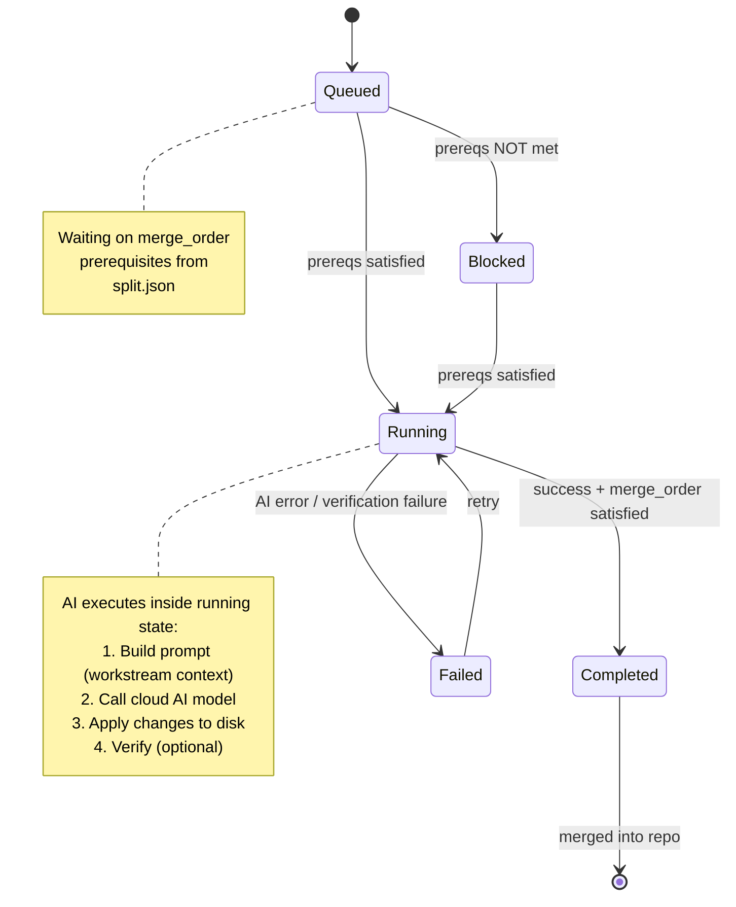
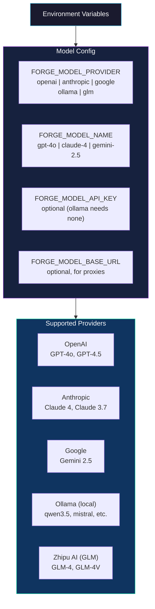
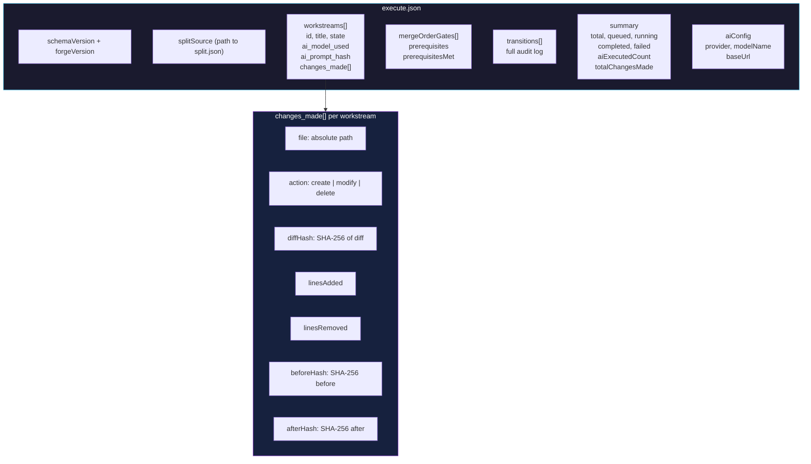
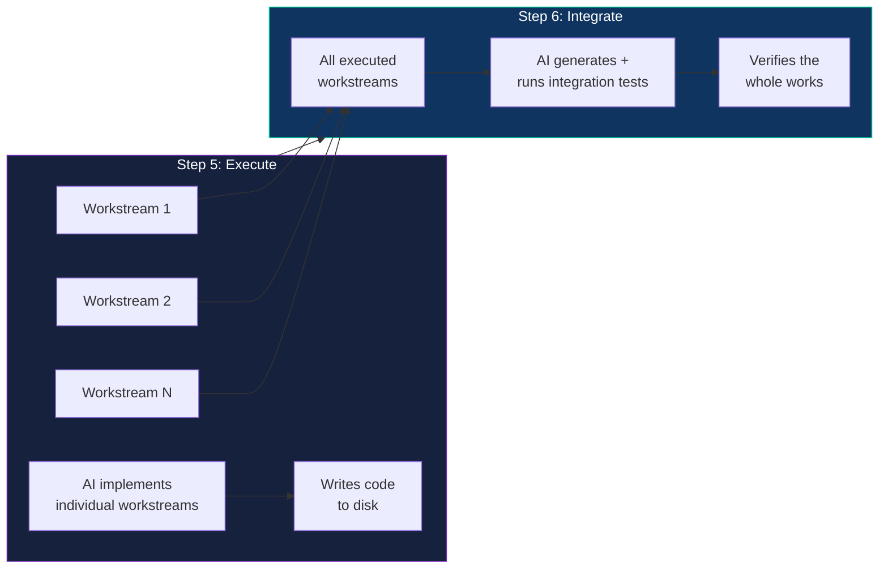

# Forge Step 5 — AI-Powered Execute Flow

> This document describes the V1 AI-powered execution flow for Forge Step 5 (`forge execute`).
> Generated from the Step 5 Batch 3 specification.

---

## Overview

Step 5 is the execution engine of the Forge pipeline. After `forge split` partitions the work into workstreams, Step 5 executes each one using an AI model. The state machine enforces merge order — ensuring workstreams run in the correct sequence — while an AI model does the actual code implementation.

---

## High-Level Flow



---

## State Machine

The state machine drives all workstream transitions. It is **unchanged from Batch 1/2** — the AI execution happens inside the `running` state.



### State Definitions

| State | Meaning |
|-------|---------|
| `queued` | Waiting for merge_order prerequisites to complete |
| `running` | AI is actively implementing this workstream |
| `completed` | AI succeeded, merge_order satisfied, merged into repo |
| `failed` | AI execution failed or verification failed |
| `blocked` | Permanently blocked by upstream (merge_order cannot be satisfied) |

---

## AI Execution Details

### What Feeds the AI Prompt

```mermaid
flowchart LR
    subgraph INPUTS["AI Prompt Inputs"]
        W["Workstream Description<br/>title + description + category"]
        F["Target Files<br/>likelyAffectedPaths contents"]
        P["Plan Context<br/>requirement → file mapping"]
        V["Verify Constraints<br/>conflict zones + safety rules"]
        M["Merge Order<br/>what must complete first"]
        C["Carried Concerns<br/>from plan + verify"]
    end

    subgraph PROMPT["Constructed Prompt"]
        direction TB
        P1["System Role<br/>skilled software engineer"]
        P2["Workstream Section<br/>title, description, category"]
        P3["Prerequisites Section<br/>merge_order prereqs with descriptions"]
        P4["Constraints Section<br/>conflict zones, findings, carried concerns"]
        P5["Target Files Section<br/>current file contents (read-only)"]
        P6["Task + Output Format<br/>make changes, return JSON"]
    end

    subgraph OUTPUT["AI Output"]
        O1["JSON: changes array"]
        O2["file, action, content"]
        O3["Applied to disk"]
    end

    INPUTS --> PROMPT
    PROMPT --> OUTPUT

    style INPUTS fill:#1a1a2e,stroke:#4cc9f0,color:#ffffff
    style PROMPT fill:#16213e,stroke:#7b2cbf,color:#ffffff
    style OUTPUT fill:#0f3460,stroke:#06d6a0,color:#ffffff
```



### Per-Workstream Prompt Structure

```
# SYSTEM ROLE
You are a skilled software engineer implementing changes to a codebase.

# WORKSTREAM DESCRIPTION
Title: {title}
Description: {description}
Category: {category}

# MERGE ORDER PREREQUISITES
Before this workstream runs, the following must be completed:
- {prereq_1_title}: {prereq_1_description}
- {prereq_2_title}: {prereq_2_description}

# IMPLEMENTATION CONSTRAINTS (from Verify step)
CRITICAL:
- {constraint_1}
- {constraint_2}

# CARRIED-FORWARD CONCERNS
- {concern_1}

# TARGET FILES (read-only — current contents)
FILE: {path_1}
---
{current_contents}
---

# YOUR TASK
Make the necessary changes to the target files above.

# OUTPUT FORMAT
Return a JSON array of changes:
```json
[
  {"file": "path", "action": "create|modify|delete", "content": "..."}
]
```
```

---

## Merge Order Enforcement

Merge order is the backbone of safe sequential execution. A workstream cannot transition to `completed` until ALL of its prerequisites are in the `merged set` (i.e., they have already transitioned to `completed`).

```mermaid
flowchart LR
    A["Workstream A"] -->|"must complete first"| B["Workstream B"]
    B -->|"must complete first"| C["Workstream C"]

    style A fill:#0f3460,stroke:#06d6a0,color:#ffffff
    style B fill:#0f3460,stroke:#06d6a0,color:#ffffff
    style C fill:#0f3460,stroke:#06d6a0,color:#ffffff

    note right of A
        state: completed
        in merged set: YES
    end note

    note right of B
        state: completed
        in merged set: YES
    end note

    note right of C
        state: running
        waits for B in merged set
    end note
```

### Merge Order Rules

1. A workstream in `queued` can only transition to `running` when ALL its `mergeOrderRequirements` are in the `merged set`
2. A workstream in `running` can only transition to `completed` when ALL its `mergeOrderRequirements` are in the `merged set`
3. The `merged set` only grows — a workstream once `completed` never leaves it
4. `failed` workstreams are NOT in the merged set and block their dependents

---

## Model Provider Configuration

Users provide their own AI model. Forge reads configuration from environment variables:



---

## execute.json Artifact

The final artifact records everything: workstream states, AI model calls, and file changes.



---

## CLI Interaction

### Interactive Mode (default)

```
$ forge execute

=== Workstream Status ===
[1] ws-add-auth         queued    waiting on: []
[2] ws-api-middleware   queued    waiting on: [ws-add-auth]
[3] ws-integration      queued    waiting on: [ws-api-middleware]

Commands: run <id> | done <id> | fail <id> [reason] | status | exit

> run 1
[AI] Calling gpt-4o for: ws-add-auth...
[AI] Modifying: src/auth.ts (+42 lines)
[AI] Creating: src/auth.test.ts (+38 lines)
✓ ws-add-auth COMPLETED — 2 files, +80 lines

> run 2
[AI] Calling gpt-4o for: ws-api-middleware...
[AI] Modifying: src/api/middleware.ts (+67 lines)
✓ ws-api-middleware COMPLETED — 1 file, +67 lines

> run 3
[AI] Calling gpt-4o for: ws-integration...
✓ ws-integration COMPLETED — 3 files, +120 lines
```

### Auto Mode

```
$ FORGE_EXECUTE_AUTO=1 forge execute
[AI] Auto-executing 3 unblocked workstreams...

[AI] ws-add-auth (1/3)...
✓ ws-add-auth COMPLETED — 2 files, +80 lines

[AI] ws-api-middleware (2/3)...
✓ ws-api-middleware COMPLETED — 1 file, +67 lines

[AI] ws-integration (3/3)...
✓ ws-integration COMPLETED — 3 files, +120 lines

All workstreams complete. Artifact written to .forge/execute.json
```

### Environment Variables

| Variable | Required | Description |
|----------|----------|-------------|
| `FORGE_MODEL_PROVIDER` | **Yes** | `openai`, `anthropic`, `google`, `ollama`, `glm` |
| `FORGE_MODEL_NAME` | **Yes** | Model name (e.g., `gpt-4o`, `claude-3-5-sonnet-4`) |
| `FORGE_MODEL_API_KEY` | No | API key (not needed for Ollama) |
| `FORGE_MODEL_BASE_URL` | No | Proxy or self-hosted endpoint |
| `FORGE_EXECUTE_AUTO` | No | Set to `1` to auto-execute all unblocked workstreams |

---

## Step 5 vs Step 6 Responsibility



| Step | What it does |
|------|-------------|
| **Step 5** | AI implements each workstream — makes actual code changes per workstream |
| **Step 6** | AI runs integration tests against the whole — verifies everything works together |

---

## V1 Scope vs V2 Future

### V1 (This Implementation)
- Single AI model execution, one workstream at a time
- Merge order strictly enforced (serial execution)
- User provides any OpenAI-compatible model
- No streaming output, no agentic loops, no tool use
- State machine drives all transitions

### V2 (Future Ideas)
- Multi-agent orchestration: parallel AI workstream execution
- Agent adapter plugin system (users provide their own agent adapters)
- Streaming output display during AI execution
- Multi-turn AI dialogue with tool use
- Model management (switch models mid-pipeline)

> See `future_idea_implementation/multi-agent-orchestration.md` for the V2 vision.
