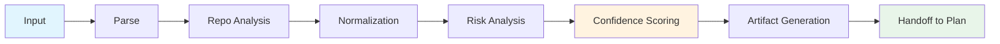
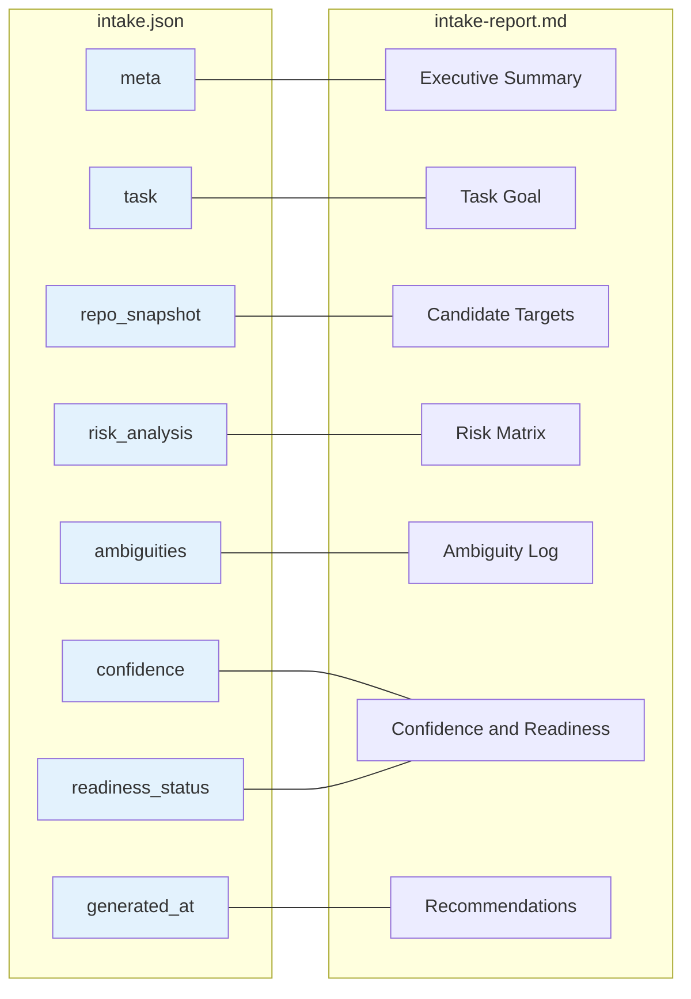
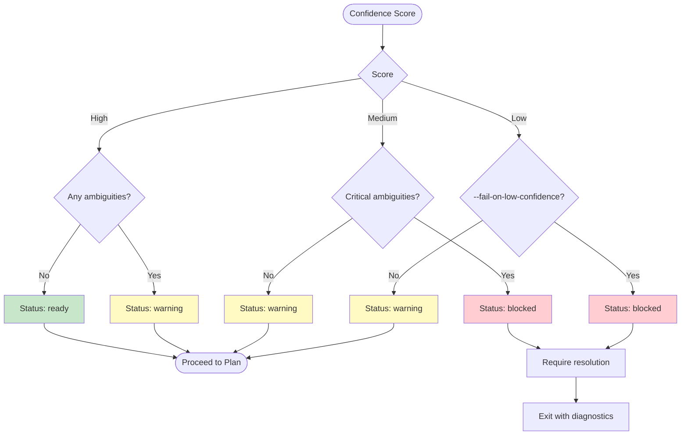

# Step 1: Intake

Intake is the first step in the Forge CLI workflow. It transforms raw task descriptions—whether provided as a structured `--spec` file or an unstructured `--prompt` string—into a durable, repository-grounded task specification. The step analyzes the codebase, normalizes requirements, evaluates risks, and scores confidence so that downstream planning (Step 2) receives a well-defined, actionable surface.

---

## What Intake Does

- **Accepts input** via `--spec task.md` or `--prompt "description"`
- **Analyzes repository structure**: detects monorepos, reads manifest files, identifies entry points
- **Normalizes task** into a structured spec with:
  - `goal`
  - `acceptance criteria`
  - `candidate targets`
  - `constraints`
- **Performs risk analysis** across four dimensions:
  - Migration risk
  - API compatibility
  - Coordination risk
  - Test coverage
- **Detects ambiguities**: missing acceptance criteria, vague scope, conflicting constraints
- **Scores confidence** as `high`, `medium`, or `low` with explicit reasons
- **Determines readiness status**:
  - `ready`
  - `warning`
  - `blocked`
- **Writes durable artifacts**:
  - `.forge/intake.json`
  - `.forge/reports/intake-report.md`
- **Supports flags**:
  - `--json-only`
  - `--report-only`
  - `--llm-assist`
  - `--fail-on-low-confidence`
- **Produces the handoff surface** for Step 2 (Plan)

---

## Flowchart



1. **Input**: Raw task is received via `--spec` or `--prompt`.
2. **Parse**: The input is parsed into an intermediate representation.
3. **Repo Analysis**: The repository is scanned for structure, manifests, and entry points.
4. **Normalization**: The raw task is structured into goal, acceptance criteria, targets, and constraints.
5. **Risk Analysis**: Risks are evaluated across migration, API compatibility, coordination, and test coverage.
6. **Confidence Scoring**: An overall confidence score (`high`, `medium`, `low`) is computed.
7. **Artifact Generation**: `intake.json` and `intake-report.md` are written to `.forge/`.
8. **Handoff to Plan**: The normalized spec is passed to Step 2.

---

## Input Modes

```mermaid
flowchart TD
    Start([Forge CLI invoked]) --> Mode{Input mode?}

    Mode -->| --spec task.md | SpecFile[Read task.md]
    Mode -->| --prompt "string" | PromptString[Read prompt string]
    Mode -->| Neither | Error[Error: missing input]

    SpecFile --> ParseSpec[Parse structured Markdown]
    PromptString --> ParsePrompt[Convert freeform text to structured stub]

    ParseSpec --> Validate[Validate required fields]
    ParsePrompt --> Validate

    Validate --> Valid{Valid?}
    Valid -->|Yes| Proceed[Proceed to Repo Analysis]
    Valid -->|No| Fix{Auto-fixable?}
    Fix -->|Yes| LLMFix[Invoke LLM to fill gaps]
    Fix -->|No| Abort[Abort with diagnostics]
    LLMFix --> Validate

    style Error fill:#ffcdd2
    style Abort fill:#ffcdd2
    style Proceed fill:#c8e6c9
```

- **`--spec task.md`**: Expects a Markdown file with front-matter or structured sections (Goal, Acceptance Criteria, Constraints). It is parsed directly into the intermediate representation.
- **`--prompt "string"`**: Accepts freeform text. Intake attempts to extract goal, criteria, and constraints heuristically; missing fields are flagged as ambiguities.
- **Missing input**: If neither flag is provided, the CLI exits with a clear error.
- **Validation loop**: After parsing, required fields are validated. If they are missing but auto-fixable (e.g., via `--llm-assist`), the LLM is invoked to fill gaps and validation is retried.

---

## Artifact Structure



### `intake.json` Schema (High-Level)

| Section | Description |
|---------|-------------|
| `meta` | Intake version, CLI version, execution timestamp |
| `task` | Normalized goal, acceptance criteria, candidate targets, constraints |
| `repo_snapshot` | Monorepo flag, detected manifests, entry points, relevant file paths |
| `risk_analysis` | Scores and notes for migration, API compatibility, coordination, test coverage |
| `ambiguities` | List of detected ambiguities with severity |
| `confidence` | Score (`high` / `medium` / `low`) and reasoning array |
| `readiness_status` | `ready`, `warning`, or `blocked` |
| `generated_at` | ISO-8601 timestamp |

### `intake-report.md` Sections

1. **Executive Summary** — One-paragraph overview of the intake result.
2. **Task Goal** — The normalized, repository-grounded goal statement.
3. **Candidate Targets** — Files, packages, or services identified as change targets.
4. **Risk Matrix** — Tabular view of the four risk dimensions.
5. **Ambiguity Log** — Numbered list of issues with suggested resolutions.
6. **Confidence and Readiness** — Final score/status and next-step guidance.
7. **Recommendations** — Actionable advice for resolving warnings/blockers.

---

## Confidence and Status Resolution



### Resolution Rules

| Confidence | Ambiguities | `--fail-on-low-confidence` | Status | Action |
|------------|-------------|---------------------------|--------|--------|
| High | None | — | `ready` | Proceed to Plan |
| High | Present | — | `warning` | Proceed; ambiguities noted |
| Medium | Non-critical | — | `warning` | Proceed; recommend review |
| Medium | Critical | — | `blocked` | Resolve before proceeding |
| Low | — | No | `warning` | Proceed at user's risk |
| Low | — | Yes | `blocked` | Resolve or override flag |

When the status is `blocked`, Intake exits with a non-zero code and prints the ambiguity log to `stderr` so that CI pipelines can catch the failure.

---

## CLI Examples

```bash
# --- Standard usage with a spec file ---
forge intake --spec task.md

# --- Standard usage with a prompt string ---
forge intake --prompt "Add OAuth2 login to the web app"

# --- JSON-only output (no Markdown report) ---
forge intake --spec task.md --json-only

# --- Report-only output (no JSON) ---
forge intake --spec task.md --report-only

# --- Enable LLM assistance for gap-filling ---
forge intake --prompt "Refactor the API layer" --llm-assist

# --- Fail the command if confidence is low ---
forge intake --spec task.md --fail-on-low-confidence

# --- Combined flags ---
forge intake --spec task.md --llm-assist --fail-on-low-confidence
```

---

## Handoff to Step 2

After Intake completes successfully (status is `ready` or `warning`), the following surface is passed to Step 2 (Plan):

- **Path to `intake.json`** — The canonical structured spec.
- **Path to `intake-report.md`** — Human-readable context for plan reviewers.
- **Normalized goal** — The single-sentence objective.
- **Acceptance criteria** — A checklist of verifiable conditions.
- **Candidate targets** — Concrete files, packages, or services.
- **Constraints** — Architectural, performance, or compatibility limits.
- **Risk profile** — Pre-computed risk scores.
- **Confidence and readiness** — Decision context for the planner.

Plan reads the `intake.json` and uses it as the authoritative input for generating implementation steps, scheduling, and dependency mapping.
