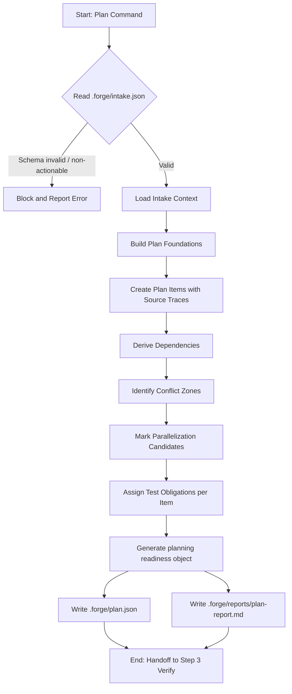
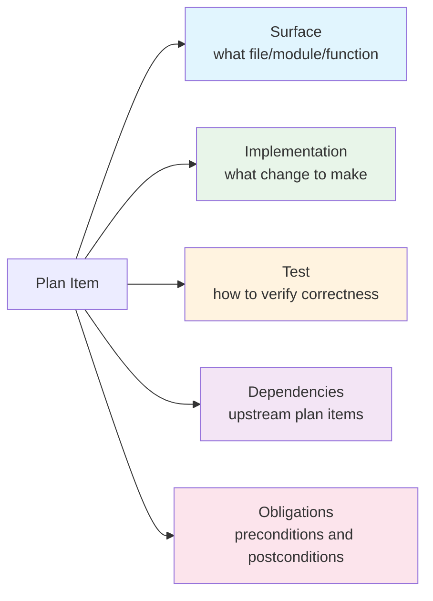
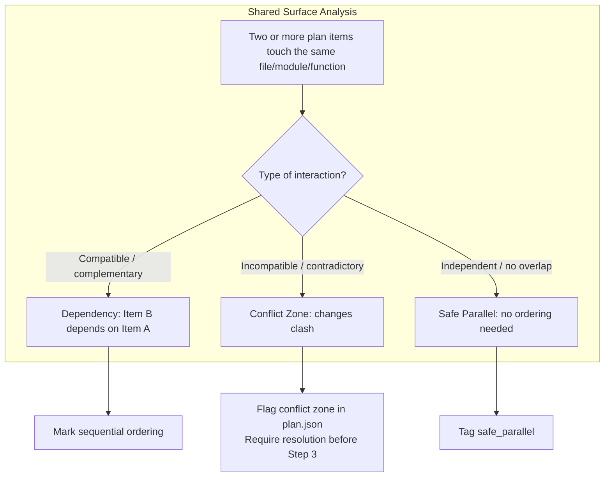
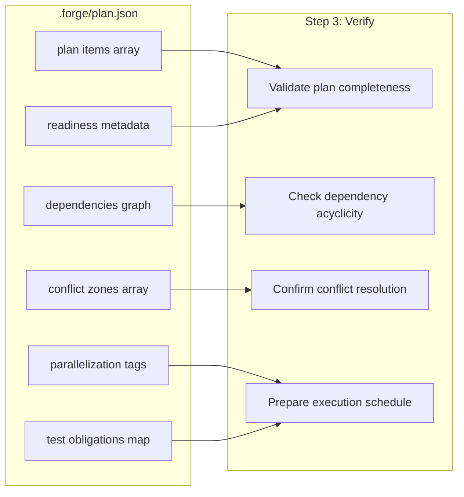

# Step 2: Plan

## Overview

The Plan step transforms the structured output from Step 1 (Intake) into an actionable, deterministic implementation plan. It does **not** re-run intake logic or re-read raw task text. Instead, it consumes the persisted `intake.json` and produces `plan.json`, along with a human-readable `plan-report.md`.

Plan is deterministic-first: every plan item, dependency, and conflict zone is derived mechanically from the intake data. The `plan` subcommand does not accept LLM flags; optional LLM assistance is configured at **intake** time (`forge intake --llm-assist`).

---

## What Plan Does

1. **Reads `.forge/intake.json`** as its sole primary input.
2. **Carries forward all intake context:** repository metadata, target files, risk flags, ambiguities, and confidence scores.
3. **Builds explicit plan-item foundations:** each item includes a source trace back to the intake object that justified it.
4. **Derives dependencies between plan items:** if one item must complete before another can safely execute, that dependency is recorded.
5. **Identifies conflict zones:** shared surfaces or logically incompatible changes are flagged explicitly.
6. **Marks parallelization candidates:** items are tagged `safe_parallel` where order-independent, or `sequential` where ordering matters.
7. **Assigns test obligations:** every plan item carries explicit testing requirements.
8. **Outputs:**
   - `.forge/plan.json` — machine-readable plan
   - `.forge/reports/plan-report.md` — human-readable report
9. **Produces a planning readiness object** as the handoff to Step 3 (Verify).
10. **Blocks on schema-invalid or non-actionable intake handoffs:** garbage in, garbage out is not tolerated.

### Environment Flags

| Flag | Effect |
|------|--------|
| `FORGE_PLAN_DEBUG=1` | Emits internal debug artifacts alongside normal outputs |

---

## Flowchart



---

## Plan Item Structure

Every plan item in `plan.json` is a self-contained unit with the following fields:



| Field | Description |
|-------|-------------|
| `id` | Unique identifier for the plan item |
| `surface` | The concrete file, module, or function to modify |
| `implementation` | Description of the change to be applied |
| `test` | Expected testing strategy or test file(s) to update |
| `dependencies` | List of upstream plan item IDs that must complete first |
| `obligations` | Preconditions (what must be true before starting) and postconditions (what must be true after finishing) |
| `source_trace` | Reference to the intake object that justified this item |

---

## Dependencies and Conflict Zones

Dependencies and conflict zones are both generated by analyzing **shared surfaces** across plan items, but they represent opposite failure modes.



### How Dependencies Are Derived

- **Data flow:** if Item B reads a symbol that Item A introduces, B depends on A.
- **Structural:** if Item A refactors a base class and Item B updates a subclass, B depends on A.
- **Build order:** if Item A changes a build script and Item B changes a test that requires the new build artifact, B depends on A.

### How Conflict Zones Are Identified

- **Shared mutable surface:** two items attempt to modify the same function body with incompatible logic.
- **Interface clash:** one item adds a parameter while another removes it.
- **Dual ownership:** two items claim authority over the same configuration key.

When a conflict zone is detected, the plan step flags it in `plan.json` and halts advancement to Step 3 until the user or an orchestrator resolves it.

---

## Handoff to Step 3

Step 3 (Verify) consumes specific sections of `plan.json`. The handoff object is explicit and minimal.



### Planning Readiness Object

```json
{
  "ready": true,
  "plan_items_count": 7,
  "dependency_count": 5,
  "conflict_zones": [],
  "parallel_groups": 3,
  "handoff_version": "2.0"
}
```

If `ready` is `false`, Verify blocks and requires human intervention or plan iteration.

---

## CLI Examples

### Basic Planning

```bash
forge plan
```

Reads `.forge/intake.json` and produces `.forge/plan.json` plus `.forge/reports/plan-report.md`.

### Debug Mode

```bash
FORGE_PLAN_DEBUG=1 forge plan
```

Emits additional debug artifacts (e.g., intermediate dependency graphs, raw surface overlap matrices) alongside normal outputs.

### Custom output directory

`plan` always reads `intake.json` from the output directory (default `.forge/`). To use a different layout, run intake (and later stages) with the same `--output-dir`:

```bash
forge intake --repo . --output-dir .forge/custom --spec task.md --no-llm --json-only
forge plan --repo . --output-dir .forge/custom
```

### Typical Output Check

```bash
ls -la .forge/
# plan.json
# reports/plan-report.md
```

---

*File generated for Forge CLI documentation. Step 2: Plan — deterministic implementation planning with dependency resolution, conflict detection, and explicit handoff to Verify.*
