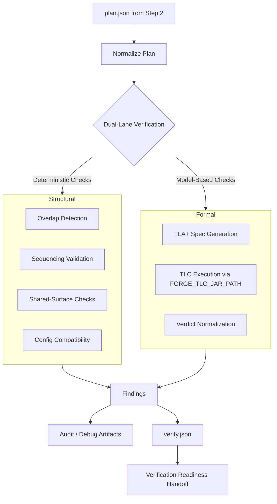
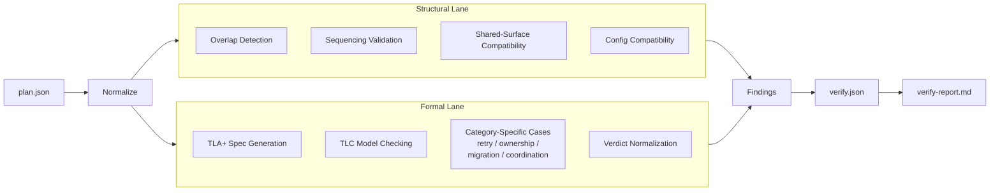
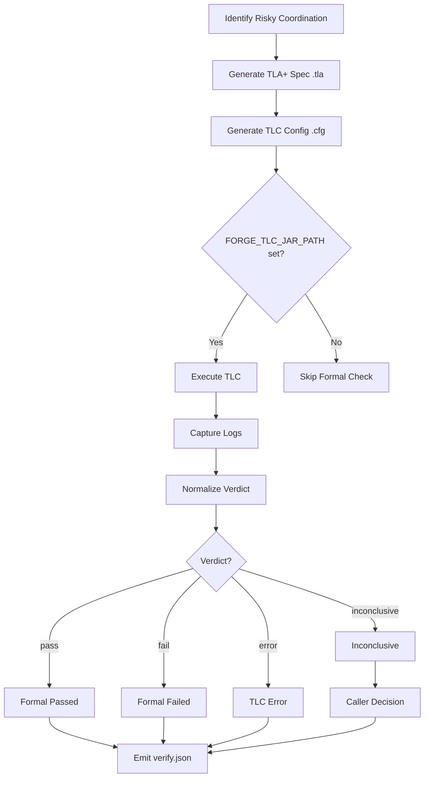
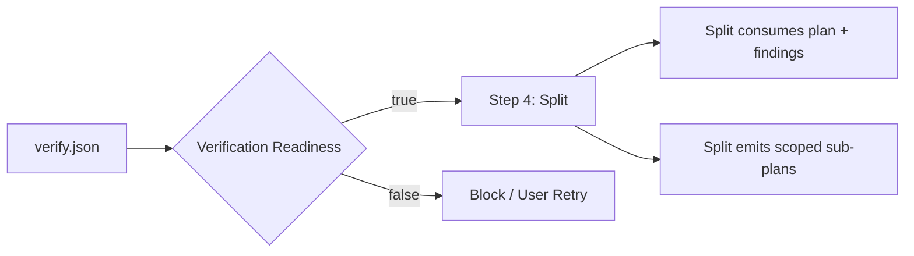

# Step 3: Verify

## Overview

**Verify** is the third step of the Forge CLI workflow. It interrogates the execution plan produced by Step 2 (Plan) for structural soundness and formal correctness *before* any coding begins. By catching coordination hazards, ordering conflicts, and compatibility issues early, Verify prevents expensive rework in later steps and acts as a gate between the planning phase and the Split phase.

Verify consumes the persisted `plan.json` from the Step 2 workspace and produces two primary outputs:

- `.forge/verify.json` — machine-readable verification results (findings, verdicts, readiness).
- `.forge/reports/verify-report.md` — human-readable report summarizing findings and next steps.

## What Verify Does

Verify runs two complementary lanes of analysis that operate in parallel:

1. **Structural Lane** — deterministic, static checks applied to every plan item.
   - Overlap detection: ensuring parallel tasks do not touch the same shared surfaces.
   - Sequencing validation: dependencies listed in the plan respect topological ordering.
   - Shared-surface compatibility: verifying that concurrent file or resource access is safe.
   - Config compatibility: checking schema, version, and parameter consistency across items.

2. **Formal Lane** — model-based verification using TLA+/TLC for *risky* coordination logic.
   - Automatically generates `.tla` specifications and `.cfg` TLC configuration files under `.forge/`.
   - Executes the TLC model checker using the `FORGE_TLC_JAR_PATH` environment variable.
   - Category-specific formal cases:
     - `retry` — bounded retries and error-propagation invariants.
     - `ownership` — lease, lock, and token handoff correctness.
     - `migration` — ordering constraints and rollback safety during data or schema migration.
     - `coordination` — parallel-execution hazards, barrier consistency, and consensus properties.
   - Verdict normalization: TLC results are mapped to `pass`, `fail`, `error`, or `inconclusive`.

Key behaviors:

- For unsupported categories, Verify falls back to the **Structural lane only**.
- `FORGE_VERIFY_DEBUG=1` preserves intermediate TLA+ artifacts and TLC logs for offline debugging.
- An **inconclusive** TLC verdict is distinct from pass/fail/error and signals that the model could not be exhaustively checked (e.g., due to state-space explosion or incomplete invariants). The caller decides whether to proceed.
- Verification readiness is the handoff signal that authorizes Step 4 (Split) to begin.

## Flowchart

The diagram below shows the high-level Verify flow from the consumed plan to the final `verify.json` output.



## Dual-Lane Architecture

Verify is intentionally split into two lanes so that fast deterministic checks can run immediately, while expensive formal checks proceed in parallel without blocking the overall pipeline.



**Structural lane outputs**
- `structural_passed` boolean
- List of overlapping tasks (if any)
- Sequencing violations
- Config drift items

**Formal lane outputs**
- `formal_passed` boolean
- `formal_verdict` ∈ {`pass`, `fail`, `error`, `inconclusive`}
- TLC log excerpts
- Generated `.tla` and `.cfg` paths (when debug is enabled)

## Formal Lane (TLA+/TLC)

The Formal lane is the heart of model-based verification in Forge. It translates risky coordination logic from the plan into TLA+ specifications, then delegates model checking to the TLC tool.



**TLA+ generation details**
- Specs are produced per category (retry, ownership, migration, coordination).
- Each `.tla` file imports standard TLC modules (`TLC`, `Integers`, `Sequences`, etc.).
- Invariants and temporal formulas encode the "risky" behaviors identified in the plan.

**TLC execution details**
- TLC is launched as a subprocess with the JAR specified by `FORGE_TLC_JAR_PATH`.
- Timeout and memory limits are inherited from the CLI flags or environment defaults.
- If TLC exits with a counter-example, the counter-example trace is parsed and attached to the report.

**Verdict normalization**
- `pass` — all invariants hold for the explored state space.
- `fail` — TLC found a counter-example.
- `error` — TLC crashed, ran out of memory, or the spec was malformed.
- `inconclusive` — exploration was incomplete (e.g., state-space too large), so the result is neither a pass nor a fail. This is treated separately so the pipeline can decide whether to block or proceed with warnings.

## Handoff to Step 4

When both lanes complete, Verify merges their findings into a single `verify.json` artifact. Verification readiness is the boolean signal that authorizes Step 4 (Split) to consume the plan plus verification metadata.



**Readiness rules**
- If the Structural lane fails, readiness is **false**.
- If the Formal lane returns `fail` or `error`, readiness is **false**.
- If the Formal lane returns `inconclusive`, readiness is **configurable**:
  - Default: readiness is **false** (conservative).
  - With `--allow-inconclusive` (or equivalent flag): readiness is **true** with warnings.
- If both lanes pass cleanly, readiness is **true**.

`verify.json` schema (minimal representation):

```json
{
  "step": 3,
  "status": "completed",
  "verification_ready": true,
  "structural": {
    "passed": true,
    "findings": []
  },
  "formal": {
    "enabled": true,
    "passed": true,
    "verdict": "pass",
    "tla_files": [".forge/specs/retry.tla"],
    "tlc_logs": [".forge/logs/retry.log"]
  }
}
```

## CLI Examples

Run Verify after Step 2 has produced a plan:

```bash
forge verify
```

Run Verify with an explicit plan file path:

```bash
forge verify --plan ./my-plan.json
```

Run Verify with debug artifacts preserved (retains `.tla`, `.cfg`, and TLC logs):

```bash
FORGE_VERIFY_DEBUG=1 forge verify
```

Run Verify with a custom TLC jar path:

```bash
FORGE_TLC_JAR_PATH=/opt/tla2tools.jar forge verify
```

Run Verify allowing inconclusive formal verdicts to yield readiness (use with caution):

```bash
forge verify --allow-inconclusive
```

View the human-readable report after Verify completes:

```bash
cat .forge/reports/verify-report.md
```

---

*Continue to [Step 4: Split](step-4-split.md) once verification readiness is achieved.*
