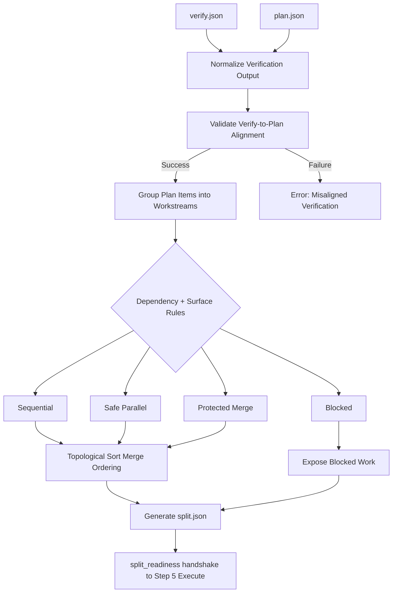
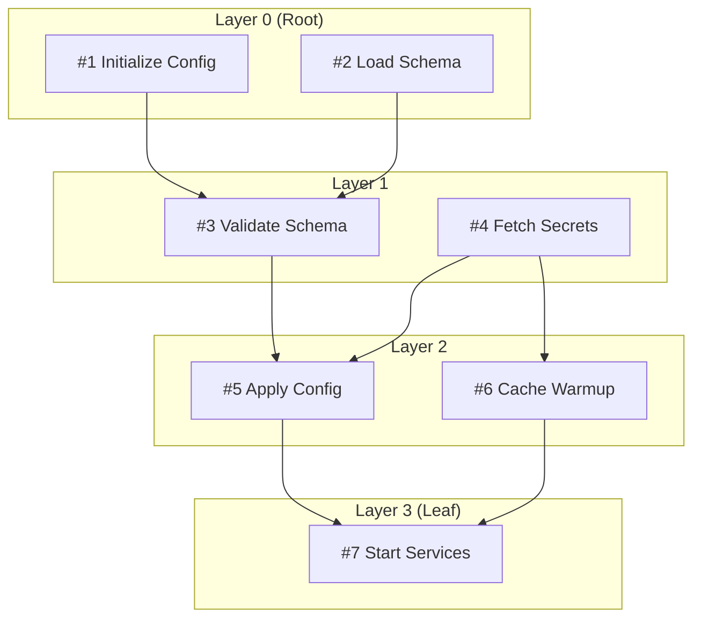
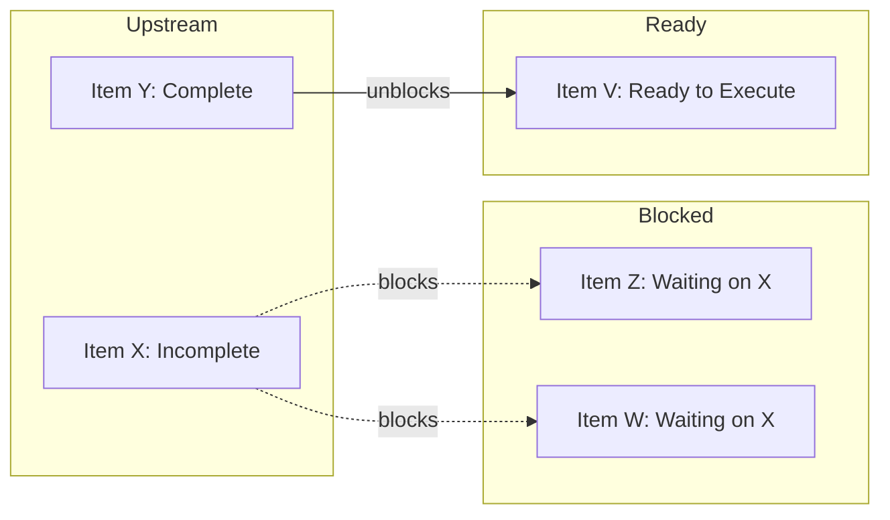
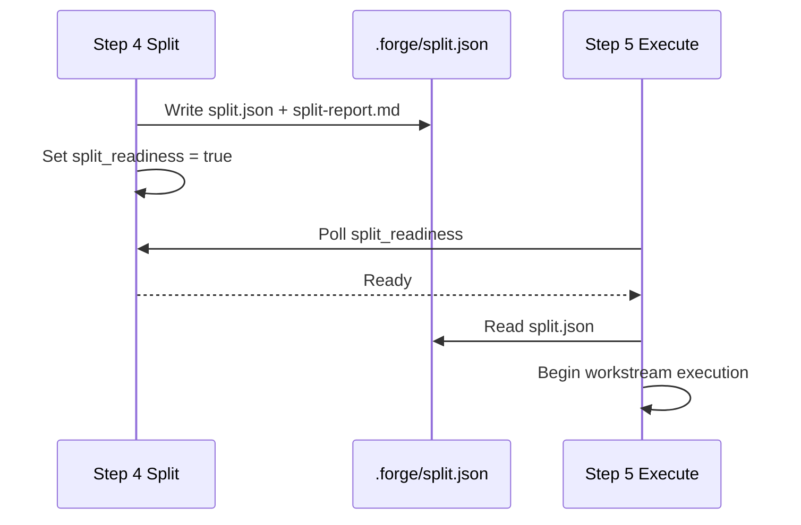

# Step 4: Split

## Overview

Split is the fourth step in the Forge CLI workflow. It transforms the verified planning output into safe, execution-ready workstreams. While Plan structures the work and Verify validates it, Split is responsible for deciding *how* the validated plan will be executed---grouping items, determining parallelism, and exposing blocked work before execution begins.

## What Split Does

Split consumes two primary artifacts from earlier steps:

- `verify.json`  --- The normalized verification results from Step 3 (Verify)
- `plan.json`    --- The structured execution plan from Step 2 (Plan)

It performs the following operations:

1. **Normalize**  
   Aligns verification output with plan evidence to create indexed, per-plan-item bundles.

2. **Validate Alignment**  
   Ensures every item in `verify.json` maps cleanly to an item in `plan.json`. Raises early if the two are inconsistent.

3. **Group into Workstreams**  
   Clusters plan items into execution workstreams using strict grouping rules:
   - **Hard dependencies** must be respected.
   - **Shared surfaces** (e.g., files, APIs, resources) are used to group items that would conflict if run in parallel without protection.

4. **Categorize Streams**  
   Each workstream is assigned exactly one category:
   - `sequential`      --- Items must run in strict order.
   - `safe_parallel`   --- Items have no conflicting dependencies or shared surfaces; safe to run concurrently.
   - `protected_merge` --- Items share a surface but can run in parallel with a merge barrier.
   - `blocked`         --- Items are waiting on upstream dependencies that are not yet satisfied.

5. **Determine Merge Ordering**  
   Applies a topological sort over all dependency edges to establish the global merge order. This guarantees that downstream items never merge before their upstream prerequisites.

6. **Expose Blocked Work**  
   Surfaces partially blocked items and upstream blockers so users can see *why* something cannot execute yet.

7. **Output Artifacts**  
   - `.forge/split.json`          --- Machine-readable split manifest.
   - `.forge/reports/split-report.md` --- Human-readable summary of streams, categories, and blocked work.

8. **Handoff to Step 5 (Execute)**  
   Sets the `split_readiness` flag and passes the split manifest forward.

9. **Debug Mode**  
   Setting `FORGE_SPLIT_DEBUG=1` emits additional debug artifacts (intermediate groupings, raw dependency graphs, and conflict matrices).

---

## Flowchart



---

## Workstream Categorization

Plan items flow into workstreams based on their dependency graph and shared surfaces. The categorizer uses a conflict-free heuristic: two items can only share a `safe_parallel` workstream if they have no hard dependency relationship *and* no shared mutable surface.

```mermaid
flowchart LR
    subgraph Input["Plan Items"]
        A1["Item A"]
        A2["Item B"]
        A3["Item C"]
        A4["Item D"]
        A5["Item E"]
    end

    subgraph Rules["Rules Engine"]
        D1["Hard Dependency?"]
        D2["Shared Surface?"]
    end

    subgraph Streams["Workstreams"]
        S1["Sequential"]
        S2["Safe Parallel"]
        S3["Protected Merge"]
        S4["Blocked"]
    end

    A1 --> D1
    A2 --> D1
    A3 --> D1
    A4 --> D2
    A5 --> D2

    D1 -->|Yes| S1
    D1 -->|No|  D2
    D2 -->|No|  S2
    D2 -->|Yes| S3
    A5 -->|Upstream missing| S4
```

---

## Merge Ordering

Merge ordering is computed as a topological sort over the full dependency DAG. This ensures that every item is only merged after all of its direct and transitive dependencies have been merged.



---

## Blocked Work Visibility

Split explicitly identifies items that cannot yet enter a workstream because their upstream dependencies are incomplete. This prevents silent stalls during execution.



In the split report, blocked items include:
- The **blocking item IDs**
- The **reason** (upstream dependency vs. shared surface lock)
- An **estimated readiness** flag if available from the plan metadata

---

## Handoff to Step 5

Once Split produces `split.json`, it sets the `split_readiness` gate. Step 5 (Execute) polls this gate before proceeding.



---

## CLI Examples

### Run Split standalone
```bash
forge split
```

### Run Split with debug artifacts
```bash
FORGE_SPLIT_DEBUG=1 forge split
```

### View the split report
```bash
cat .forge/reports/split-report.md
```

### Inspect the machine-readable manifest
```bash
jq '.workstreams[] | {id, category, items}' .forge/split.json
```
