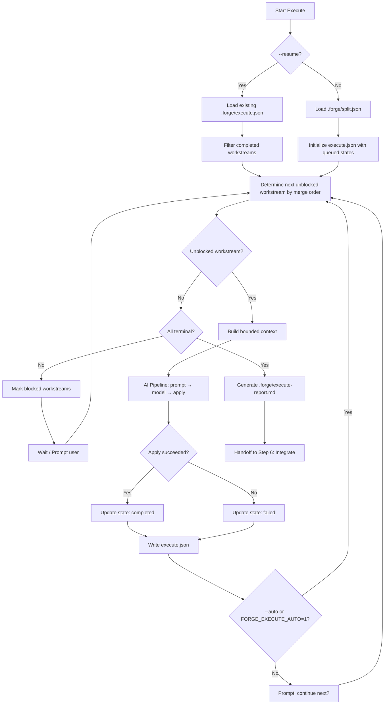
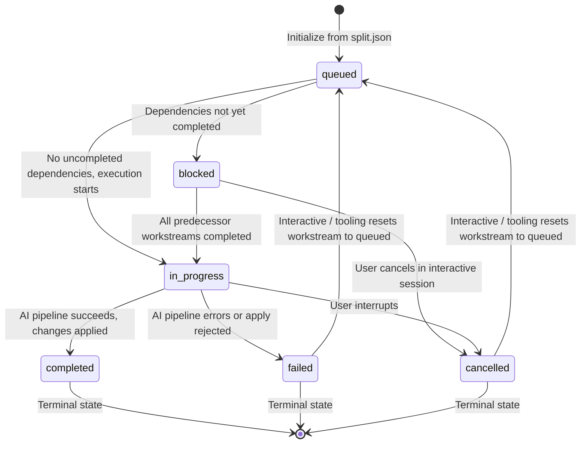
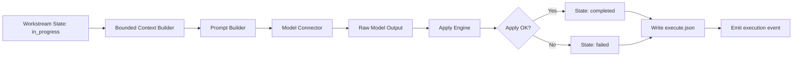
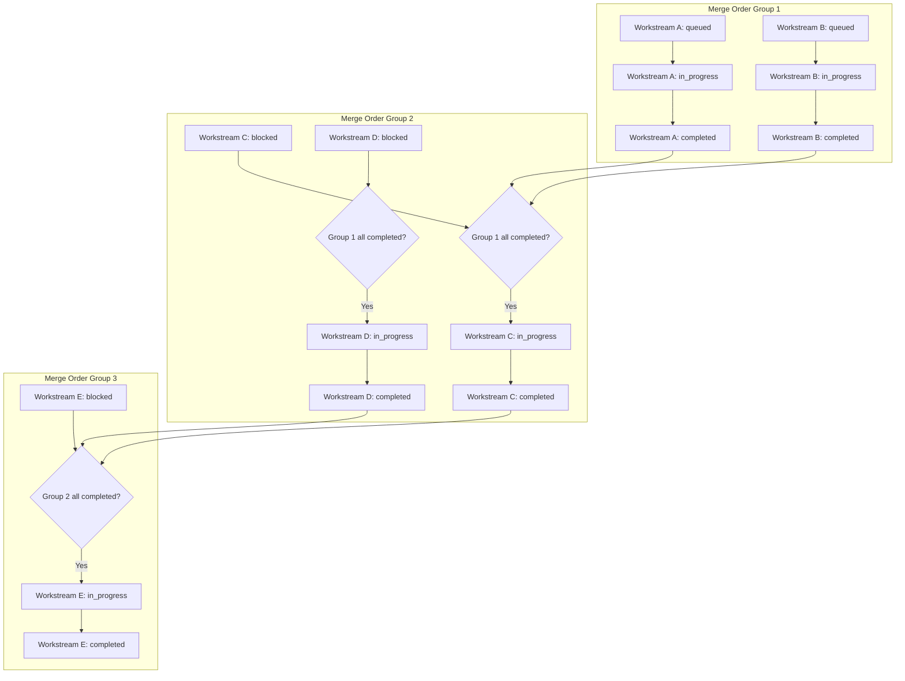

# Step 5: Execute

## Overview

The **Execute** step is the implementation engine of the Forge CLI workflow. It consumes the split plan produced in Step 4 and drives each workstream through a structured lifecycle: preparing bounded context, invoking the AI pipeline, applying generated changes, and tracking state. Execute respects merge ordering so that dependent workstreams are completed before dependents are unblocked, supports both interactive and fully automated modes, and produces a persistent execution report and state file for handoff to Step 6 (Integrate).

## What Execute Does

- **Reads** `.forge/split.json` — the workstream plan and merge order produced by Step 4.
- **Tracks** every workstream through a discrete state machine (`queued` → `blocked` → `in_progress` → `completed` / `failed` / `cancelled`).
- **Respects merge ordering** — workstreams with unresolved dependencies remain `blocked` until all predecessors are `completed`.
- **Builds bounded context** for each in-progress workstream so the AI pipeline receives only the relevant files and instructions.
- **Runs the AI pipeline** per workstream: prompt builder → model connector → apply → state transition.
- **Supports `--auto`** to auto-execute all currently unblocked workstreams in merge order without prompting.
- **Supports `FORGE_EXECUTE_AUTO=1`** environment variable as an alternative to the `--auto` flag.
- **Supports `--resume`** to continue execution from an existing `.forge/execute.json` state file, skipping already-completed workstreams.
- **Outputs**:
  - `.forge/execute.json` — live execution state (updated after every transition).
  - `.forge/execute-report.md` — human-readable markdown report summarizing all workstream outcomes.
- **Hands off** to Step 6 (Integrate) once every workstream is terminal (`completed`, `failed`, or `cancelled`).

## Flowchart



## Workstream State Machine



## AI Integration Pipeline



## Parallel Execution in Merge Order



> **Note:** Within each merge-order group, eligible workstreams can execute concurrently. Dependent groups wait until **all** workstreams in the preceding group reach a terminal state before any downstream workstream is unblocked.

## Handoff to Step 6

After all workstreams are terminal, Execute finalizes its outputs and signals readiness for Step 6 (Integrate):

1. **Final state validation** — verifies no workstream remains in `queued`, `blocked`, or `in_progress`.
2. **Report generation** — writes `.forge/execute-report.md` summarizing:
   - Total workstreams
   - Completed count
   - Failed count
   - Cancelled count
   - Per-workstream summary with file changes and error logs
3. **State file freeze** — `.forge/execute.json` is written with a `ready_for_integrate: true` flag.
4. **Integrate reads** `.forge/execute.json` and `.forge/execute-report.md` alongside other artifacts for the integration gate.

## CLI Examples

### Basic execution (interactive)
```bash
forge execute
```
Prompts for each unblocked workstream in merge order.

### Auto-execute all unblocked workstreams
```bash
forge execute --auto
```
Equivalent to:
```bash
FORGE_EXECUTE_AUTO=1 forge execute
```

### Resume from previous execution state
```bash
forge execute --resume
```
Skips already-completed workstreams and continues from where execution left off.

### Start fresh (discard prior execute state)
```bash
forge execute --force
```
Re-initializes execution from `split.json` even when `.forge/execute.json` already exists.

State transitions such as retrying a failed workstream or cancelling one are handled in the **interactive execute session** (not via `--retry` / `--cancel` CLI flags). Use `forge execute --help` for the current flag list.

