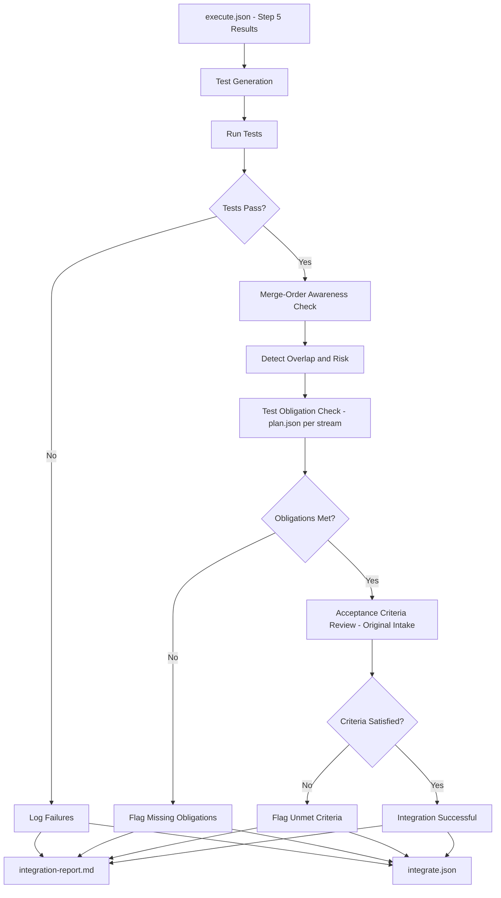
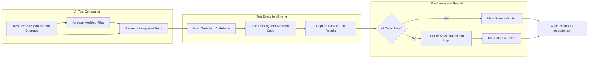
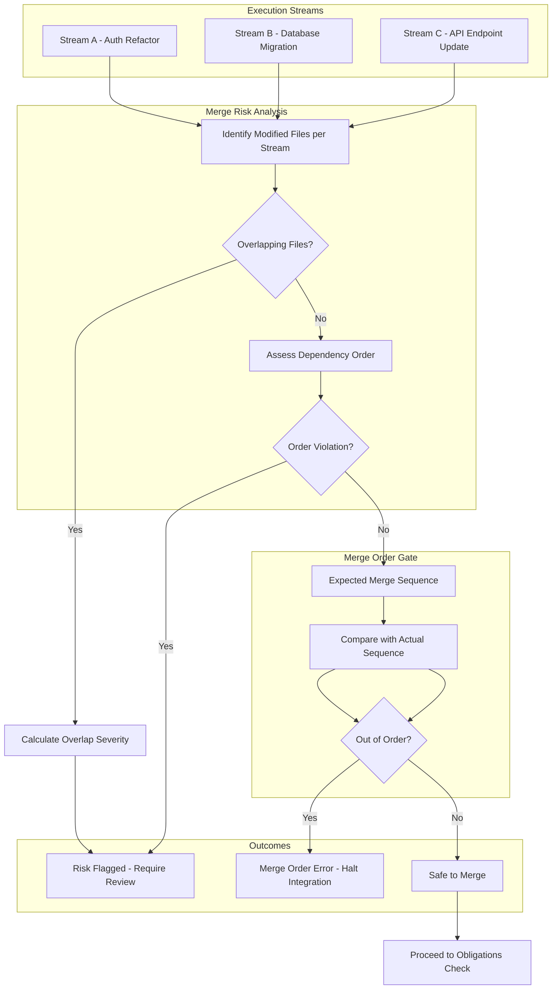

# Step 6: Integrate

## Overview

The Integrate step is the final validation gate of the Forge CLI workflow. It brings all execution streams back together with engineering discipline, ensuring that the work performed across parallel streams is sound, tested, and ready for production.

Whereas earlier steps focus on planning, breaking down work, and executing individual streams, Integrate answers the critical question: Does the completed work actually work?

It is the last checkpoint before a Forge task is considered complete.

---

## What Integrate Does

Integrate consumes artifacts from previous steps and performs a comprehensive validation pass:

- Consumes .forge/execute.json - the workstream execution results from Step 5 (Execute).
- Generates integration tests via AI, tailored to the changes made in each stream.
- Runs tests against the modified codebase using the generated test suite.
- Checks merge-order awareness - ensures streams are merged in a safe, dependency-aware sequence.
- Detects overlap and risk between merged streams. Identifies potential conflicts, duplicated efforts, or contradictory changes.
- Checks test obligations from plan.json per stream. Each execution stream may carry specific testing requirements; Integrate verifies they are met.
- Reviews acceptance criteria from the original intake (Step 1). Confirms the completed work satisfies the stated requirements.
- Produces integrate.json and integration-report.md - the final artifacts that document whether the task passes or fails integration.

### Optional Flags

| Flag | Description |
|------|-------------|
| --test-framework | Specifies the testing framework: jest, vitest, pytest, etc. |
| --json-only | Skips integration-report.md generation; outputs only integrate.json. |
| --auto | Runs in non-interactive mode without prompting for user input. |
| --delay | Adds a delay (in ms) between AI calls to respect rate limits. |
| --max-retries | Sets the maximum number of retries if transient failures occur. |

If Integrate passes, the full Forge workflow is complete for this task.

---

## Flowchart

The following diagram illustrates the high-level flow of the Integrate step, from consuming execution results to producing the final integration artifacts.



---

## Integration Test Pipeline

Integration tests are AI-generated based on the changes introduced by each execution stream. This pipeline shows how tests are created, executed, and evaluated.



### How It Works

1. AI reads execute.json to understand which files each stream modified.
2. AI generates integration tests covering the new or changed functionality.
3. Tests are injected into the codebase (respecting the --test-framework flag).
4. Test runner executes the suite against the modified code.
5. Results are captured - pass or fail - and recorded in integrate.json.

---

## Merge Risk Detection

When multiple streams modify the same codebase, there is inherent risk of overlap, conflict, or ordering issues. Integrate performs automated risk detection before declaring success.



### Key Risk Checks

- File Overlap Detection: Flags when two or more streams touch the same file(s).
- Dependency Ordering: Ensures prerequisite streams are merged before dependent ones.
- Risk Scoring: Overlaps are scored by severity; high-severity overlaps block integration pending manual review.

---

## The Complete Forge Workflow

The diagram below shows all six Forge CLI steps in sequence, with the artifacts produced and consumed at each stage.

```mermaid
flowchart LR
    subgraph Step1[Step 1: Intake]
        S1A[User submits task]
        S1B[intake.md - acceptance-criteria.json]
    end

    subgraph Step2[Step 2: Scope]
        S2A[Analyze task complexity]
        S2B[scope.json - effort-estimate.md]
    end

    subgraph Step3[Step 3: Plan]
        S3A[Design workstreams and dependencies]
        S3B[plan.json - workstream-tasks/]
    end

    subgraph Step4[Step 4: Break]
        S4A[Decompose into atomic PRs]
        S4B[break.json - pr-specs/]
    end

    subgraph Step5[Step 5: Execute]
        S5A[Run workstreams in parallel]
        S5B[execute.json - modified-codebase/]
    end

    subgraph Step6[Step 6: Integrate]
        S6A[Validate all streams together]
        S6B[integrate.json - integration-report.md]
    end

    S1A --> S1B --> S2A
    S2A --> S2B --> S3A
    S3A --> S3B --> S4A
    S4A --> S4B --> S5A
    S5A --> S5B --> S6A
    S6A --> S6B --> DONE[(Task Complete)]
```



### Artifact Summary

| Step | Artifact(s) | Purpose |
|------|-------------|---------|
| Intake | intake.md, acceptance-criteria.json | Captures what needs to be done and what success looks like. |
| Scope | scope.json, effort-estimate.md | Defines the size and boundaries of the work. |
| Plan | plan.json, workstream-tasks/ | Outlines the workstreams, their tasks, and dependencies. |
| Break | break.json, pr-specs/ | Breaks workstreams into atomic, reviewable PRs. |
| Execute | execute.json, modified codebase | Performs the actual code changes across streams. |
| Integrate | integrate.json, integration-report.md | Validates everything and provides final sign-off. |

---

## When Integration Is Complete

Integration is considered complete and the Forge workflow successful when:

1. All generated integration tests pass.
2. No unresolved merge-order violations exist.
3. Detected overlap/risk between streams is within acceptable thresholds or manually approved.
4. Every test obligation from plan.json (per stream) is satisfied.
5. All acceptance criteria from the original intake are met.
6. integrate.json and integration-report.md have been generated successfully.

If any of the above conditions fail, the integration is halted, the issues are documented in the report, and manual intervention may be required.

---

## CLI Examples

### Basic Integration

Run the integration step with default settings:

```bash
forge integrate
```

### Specify Test Framework

Use vitest for running generated tests:

```bash
forge integrate --test-framework vitest
```

### Non-Interactive Mode

Run without prompting for user input, suitable for CI/CD pipelines:

```bash
forge integrate --auto
```

### JSON-Only Output

Skip generating integration-report.md and only produce integrate.json:

```bash
forge integrate --json-only
```

### Rate-Limited / Retry Configuration

Add a 2000ms delay between AI calls and allow up to 5 retries:

```bash
forge integrate --delay 2000 --max-retries 5
```

### Full Example

Combine multiple flags for a robust CI integration:

```bash
forge integrate --test-framework jest --auto --json-only --delay 1500 --max-retries 3
```

---

Note: If the Integrate step passes successfully, the Forge workflow is fully complete for the current task, and no further Forge steps are required.
